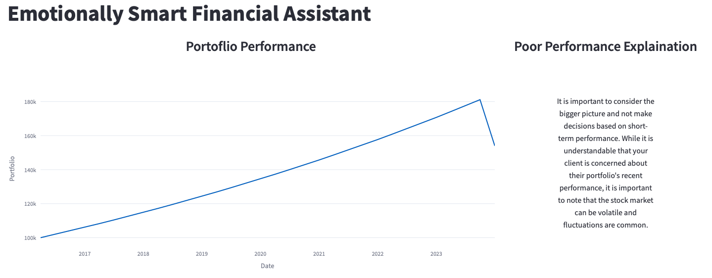

# AIFinCom

 AI tool to generate financial communication for advisors and analyst for their prospective clients.

This project is a web application that uses artificial intelligence to create customized and timely messages for financial advisors to communicate with their clients. The application analyzes the clients’ profiles, preferences, and goals, and generates relevant and personalized content that helps the advisors build trust and loyalty. This project aims to enhance the quality and efficiency of client communication for financial advisors, and increase their retention and satisfaction rates.

## Demo

You can try out the web application here: [Emotionally Smart Financial Assistant](https://emotionally-smart-financial-assistant.streamlit.app)




## Local Setup

To run the web application locally, you need to clone this repository and install the required dependencies.

```bash
git clone https://github.com/roysaurav/Emotionally-Intelligent-Financial-Assistant.git
cd Emotionally-Intelligent-Financial-Assistant
pip install -r requirements.txt
streamlit run FinancialAssistant.py
```

## Contributing
If you want to contribute to this project, you are welcome to do so. You can fork this repository, make your changes, and submit a pull request. You can also open an issue if you find any bugs or have any suggestions for improvement.

Or Contact me here - https://forms.office.com/r/TWmvm6VMp5